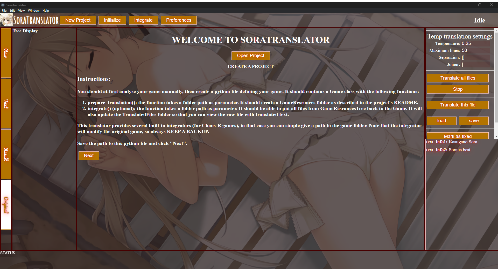
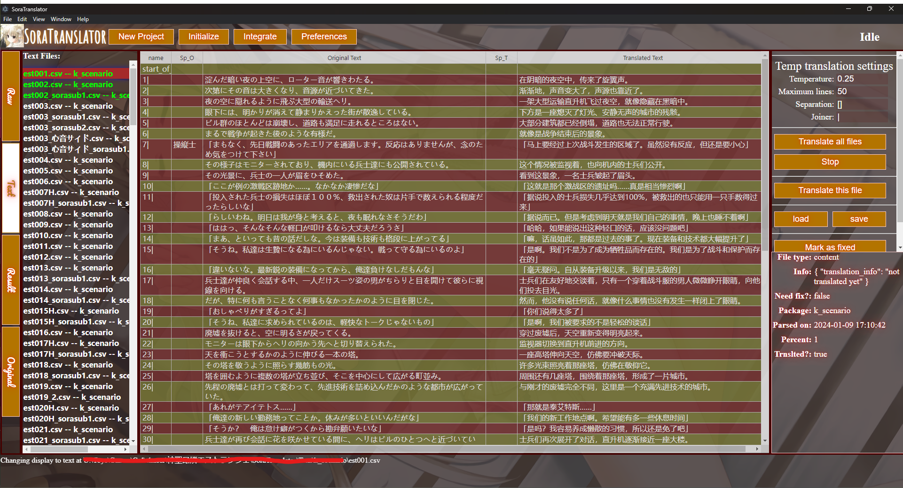

# SoraTranslator
## Automated Translation for Galgames

SoraTranslator is a tool designed to extract, translate, and reinsert text in Galgames (Japanese visual novels). This tool primarily automates the translation process for these games, leveraging the capabilities of ChatGPT's API for efficient language conversion.

### Project Overview

SoraTranslator operates by integrating with specific Galgames, focusing on the extraction, translation, and reintegration of game text. It's structured to handle various aspects of this process, from accessing original game resources to generating translated files ready for gameplay.

It focuses on the improvement of the translation quality by human intervention. The translation is done by the GPT API, but the translator can choose to modify the translation if it is not satisfactory. It also focuses on **saving tokens**, by providing context by a specific separation method (now only works with the 16k model). Any misalignment of the text will be recorded and the translator can easily fix it by modifying the text in an Excel-like table powered by [Handsontable](https://handsontable.com/).

The translator module can also be used for other purposes, but some functions (like keeping the same amount of blocks in the translation) might not be needed in other cases.


*Figure: The start page of the program.*


*Figure: Translation page of the program*

#### Project Structure

The project is organized as follows:

```
SoraTranslator/
|─── backend/
|    |── Integrators/
│       ├── GameName/
│           ├── Extractor/
│           ├── Parser/
|    |── Translators/
|─── frontend/
|    |... (to be added)
|─── GameResources/
│    ├── OriginalFiles/
│    ├── RawText/
│    ├── Text/
│    ├── TranslatedFiles/
```

Each directory is designed to handle a different stage of the translation process:

- **Integrators**: Contains tools for extracting and parsing game text.
- **Translators**: Dedicated to the translation process.
- **GameResources**: Stores the original game files, extracted text, translated text, and the final translated game files. This folder is chosen by the user.

---

#### How to Use

##### Requirements
- Python >= 3.8
- Node.js >= 20.0.0
- A ChatGPT API key

##### Installation
1. Clone the repository
2. Install the required packages and run the program by running `run.bat`

A usage tutorial video will be added soon.

##### Integration
To utilize SoraTranslator for different games, particularly from various companies, custom integrators must be written to handle the specific file formats and structures of each game.
The extraction could be empty if you already have the text extracted from the game.
The parser, no matter how it works, should output the text in a uniform format (in **.csv** files), with the following structure:
You don't have to use the data structures written in this program. But your game definition file must contain the functions declared in `backend/game.py`.

*The comma is better for illustration, use "\t" in the real file.*
```
block1_name,original_speaker,original_text,translated_speaker,translated_text,is_translated,translation_date,translation_method
block2_name,original_speaker,original_text,translated_speaker,translated_text,is_translated,translation_date,translation_method
...
```

The first 5 parts are necessary, so every line should have at least 5 parts (4 "\t"s) for the translation engine to read the text.

*The program will soon add support for .json format, which will be more flexible.*

##### Translation
The translation process is handled by the Translator module, which is designed to function separately from the integrator. This allows the extension of the usage of the program. For example, you can put the text of Doujinshi in the `Texts` folder and translate it without the need to integrate it into a game. However, the above format is still required.

The translator will translate the text file in '.csv' and replace the text in the 4th and 5th columns as shown above. The translated text will be saved in the same file. The translation method and date will also be recorded.

There can be multiple translators for the program. However, the program is designed to work with GPT API or manual translation.


#### Workflow

1. **Extraction**: The integrator accesses the `OriginalFiles` directory (the best way is to put a "file_path.py" inside the folder recording all files and information about the game), extracting and parsing game text into a readable format (.csv) in the `Texts` folder. (There will also be a `RawText` folder for the raw text extracted from the game, this allows easier "roll back" if you did something wrong.)
2. **Translation**: Utilizing the Translator module (at the front end), the text in `Texts` is then translated, with the results stored in the same file.
3. **Reintegration**: Finally, the integrator takes the translated text in `Texts` and repackages it into the game's raw text format, saving these files in the `TranslatedFiles` directory for use in the game.

#### To-Do
- [x] Write backend
- [x] Fix #9
- [ ] Translate the speakers and options
- [ ] Translate the *Onomatopoeia*
- [x] Write frontend
- [ ] Add support for translating a to_translate_file_list method for translating things other than games (frontend minor changes)
- [ ] ~~Add support for local LLM models for the translation of unallowed content (GPT API actually doesn't filter out any sensitive content)~~
- [ ] Too many to-dos are listed in the issues -_-

#### Thanks
- OpenAI for the possibility
- [Handsontable](https://handsontable.com/) for the table
- [ONScripter-EN-Steam](https://github.com/GoldbarGames/ONScripter-EN-Steam) for the tools around NScripter
- [XP3Unpacker](Unknown) for the tools around Kirikiri
