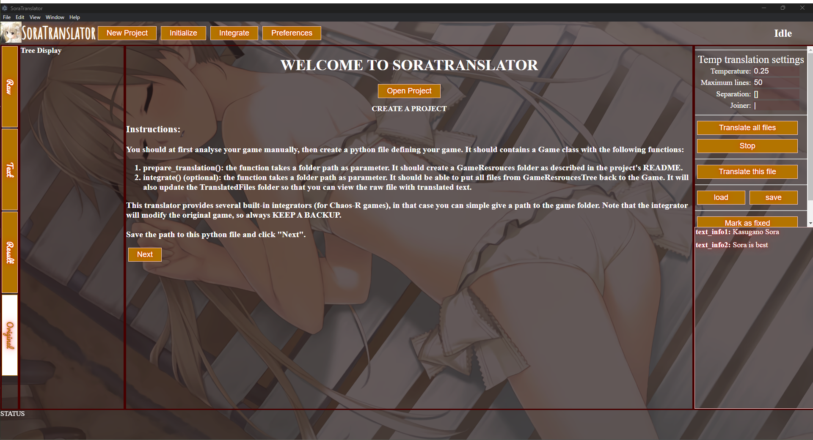
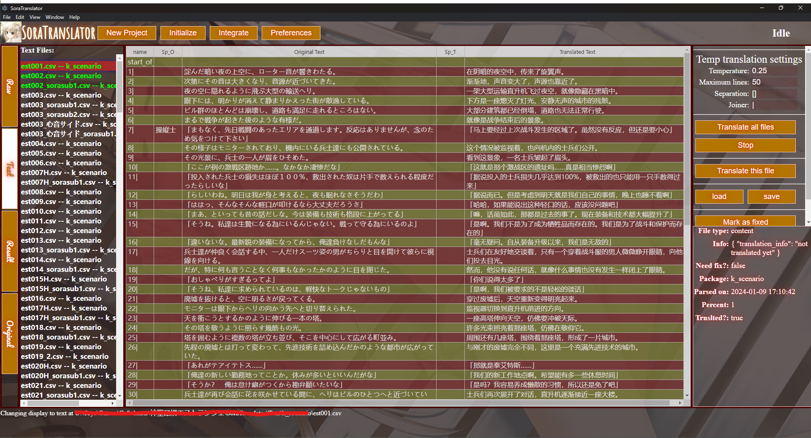

# SoraTranslator
## Automated Translation for Galgames

SoraTranslator is a tool designed to extract, translate, and reinsert text in Galgames (Japanese visual novels). This tool primarily automates the translation process for these games. The GUI provides a easy-to-use interface for correcting manual or compare the translation results.

### Project Overview

SoraTranslator operates by integrating with specific Galgames, focusing on the extraction, translation, and reintegration of game text. It's structured to handle various aspects of this process, from accessing original game resources to generating translated files ready for gameplay.

It focuses on the improvement of the translation quality by human intervention. The translation is done by the AI translator selected, but the user can choose to modify the translation if it is not satisfactory by modifying the text in an Excel-like table powered by [Handsontable](https://handsontable.com/).

The build-in translator focuses on **saving tokens**, by providing context by a specific separation method (now only works with the 16k model). Any misalignment of the text will be recorded and the translator can easily fix it. Other translators are also supported, like the GalTransl translator, which is included in the program.

The translator module can also be used for other purposes, but some functions (like keeping the same amount of blocks in the translation) might not be needed in other cases.


*Figure: The start page of the program.*


*Figure: Translation page of the program*

#### Project Structure

The project is organized as follows:

```
SoraTranslator/
|─── backend/
|    |── Integrators/
│       ├── GameName/
│           ├── Extractor/
│           ├── Parser/
|    |── Translators/
|─── frontend/
|    |...

GameFolder
|─── SoraTranslator/
│    ├── OriginalFiles/
│    ├── RawText/
│    ├── Text/
│    ├── TranslatedFiles/
```

Each directory is designed to handle a different stage of the translation process:

- **Integrators**: Contains tools for extracting and parsing game text.
- **Translators**: Dedicated to the translation process.
- **GameFolder/SoraTranslator**: Stores the original game files, extracted text, translated text, and the final translated game files. This folder is chosen by the user.

---

#### How to Install

##### Requirements
- Python >= 3.8
- Node.js >= 20.0.0
- API key for your selected endpoint (OpenAI/Gemini/Grok/etc.)

If you use the released version, the requirements may not be necessary.

##### Installation
1. Clone the repository, or download the latest release zip and unzip it.
2. If using source mode, build frontend executable (`npm run electron:build` inside `frontend`) and package with `package.bat`.
3. For portable releases, use the deterministic layout documented in [docs/release-layout.md](docs/release-layout.md).

#### How to Use
##### Portable release (recommended)
1. Unzip the release folder.
2. Run `setup-config.bat` once and enter endpoint/model/API key.
3. Run `run.bat`.

##### Source/development mode
1. Install backend/frontend dependencies as needed.
2. Run `run.bat --dev`.

The launcher now:
- auto-detects Python (`py -3` fallback to `python`)
- creates `backend/.venv` if missing
- skips `pip install` when requirements and Python version are unchanged
- waits for backend health before launching frontend
- cleans backend process on frontend exit

##### Troubleshooting
- `Python 3 not found`: install Python 3.8+ and ensure `py` or `python` is in `PATH`.
- `Backend did not become ready`: check `backend/backend.log` and verify local firewall/antivirus rules.
- Endpoint auth errors: rerun `setup-config.bat` and verify the key for the selected endpoint.
- To run launcher checks without frontend, use `run.bat --smoke`.
- For quick local checks without package reinstall work, use `run.bat --smoke --skip-install`.
- Launcher execution details are written to `log.txt` in the app root (mirrored to `launcher.log.txt` for compatibility).
- Dev/release runs are unlimited by default; set `--max-runtime-seconds <N>` if you want an enforced hard stop.
- Smoke runs keep a short default runtime guard for launcher checks.
- Release mode uses backend port `5000` by default for compatibility; override with `--backend-port <N>`.
- Startup/install wait time is independently bounded; tune with `--startup-timeout-seconds <N>`.
- Packaging logs are written to `package.log.txt`.

##### Secret Handling Policy
- Do not commit plaintext API keys.
- Store runtime keys in `.env` (created by setup) and reference them with `ENV:<KEY_NAME>` in config files.
- `config.template.json`, `translators.json`, and docs are secret-safe defaults only.
- Legacy plaintext keys are still read for compatibility, but migration to env-backed values is recommended.

A usage tutorial video can be found at [here](https://www.bilibili.com/video/BV1eM4m1z7bw/).


#### Advanced Usage

##### Integration
To utilize SoraTranslator for different games, particularly from various companies, custom integrators must be written to handle the specific file formats and structures of each game.
The extraction could be empty if you already have the text extracted from the game.
The parser, no matter how it works, should output the text in a uniform format (in **.csv** files), with the following structure:
You don't have to use the data structures written in this program. But your game definition file must contain the functions declared in `backend/game.py`.

*The comma is better for illustration, use "\t" in the real file.*
```
block1_name,original_speaker,original_text,translated_speaker,translated_text,is_translated,translation_date,translation_method
block2_name,original_speaker,original_text,translated_speaker,translated_text,is_translated,translation_date,translation_method
...
```

The first 5 parts are necessary, so every line should have at least 5 parts (4 "\t"s) for the translation engine to read the text.

*The program will soon add support for .json format, which will be more flexible.*

##### Translation
The translation process is handled by the Translator module, which is designed to function separately from the integrator. This allows the extension of the usage of the program. For example, you can put the text of Doujinshi in the `Texts` folder and translate it without the need to integrate it into a game. However, the above format is still required.

The translator will translate the text file in '.csv' and replace the text in the 4th and 5th columns as shown above. The translated text will be saved in the same file. The translation method and date will also be recorded.

There can be multiple translators for the program. However, the program is designed to work with GPT API or manual translation.

Usage of the GalTransl translator is suggested, it is included now in the program, thanks to [GalTransl](https://github.com/xd2333/GalTransl)!


#### Workflow

1. **Extraction**: The integrator accesses the `OriginalFiles` directory (the best way is to put a "file_path.py" inside the folder recording all files and information about the game), extracting and parsing game text into a readable format (.csv) in the `Texts` folder. (There will also be a `RawText` folder for the raw text extracted from the game, this allows easier "roll back" if you did something wrong.)
2. **Translation**: Utilizing the Translator module (at the front end), the text in `Texts` is then translated, with the results stored in the same file.
3. **Reintegration**: Finally, the integrator takes the translated text in `Texts` and repackages it into the game's raw text format, saving these files in the `TranslatedFiles` directory for use in the game.

#### To-Do
- [ ] Translate the speakers and options
- [ ] Add support for more games
- [ ] Add support for MTools
- [ ] Add support for translating doujinshi

#### Thanks
- OpenAI for the possibility, which helps me to translate what I've been wanting to play for centuries
- [Handsontable](https://handsontable.com/) for the table
- [ONScripter-EN-Steam](https://github.com/GoldbarGames/ONScripter-EN-Steam) for the tools around NScripter
- [XP3Unpacker](Unknown) for the tools around Kirikiri
- [GalTransl](https://github.com/xd2333/GalTransl)
