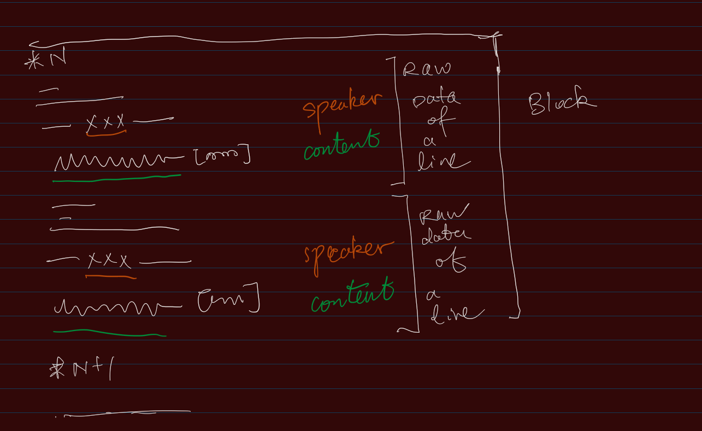

## Classes

### Class Block and Class Line

<!-- Description of Class 1 -->

A *Block* is part of a script file that should be treated as a single unit. It could not exist in certain games where the script file is just a list of "Lines". But anyway, it is still a good practice to divide a file into multiple blocks for better readability and translation. The parsing function of a block should be able to divide a block into multiple lines.

A *Line* is a line of speech or narration in the game. Usually around this line, there will be script functions that control the performance of the game. We call the entire structure of a line and its surrounding functions the *raw content* of the line. This leaves a structure shown in the figure below.

*Figure: Schematic diagram of the structure of blocks and lines.*

A line doesn't only contain the speech or narration, but also the speaker and other information (like in "auto" mode how long should it be displayed). It is important that the class "Line" will be able to parse the raw content and extract the information. It should provide the content in plain text with speakers that facilitate translation. It should also provide the functionality of integrating the information back into the raw content and form the *translated text*.

The lines and blocks should only be read from original game script files (*RawText*) because otherwise it won't be able to perform the integration actions. If translation is performed seperately (which is usually the case), the verification method of the *File* class should be able to check the coherence between the .csv file and the corresponding raw text file.
